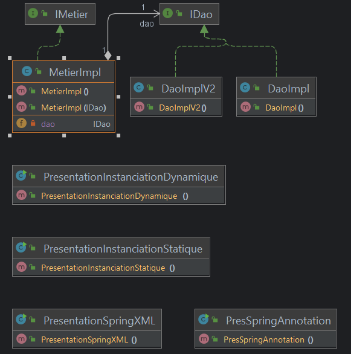

<h1>Partie 1 : Injection des Dépendances</h1>

Dans ce projet, nous mettons en œuvre différentes méthodes d'injection de dépendances:

<ul>
    <li>
        
<strong>a. Instanciation statique :</strong> Créez manuellement des instances de classes pour comprendre cette approche traditionnelle.

    </li>
    <li>
        
<strong>b. Instanciation dynamique :</strong> Apprenez à instancier des classes dynamiquement pour une gestion flexible des dépendances.

    </li>
    <li>
        
<strong>c. Avec Spring :</strong>

        <ol>
            <li><strong>Version XML : </strong>Configurez l'injection de dépendances via des fichiers XML.</li>
            <li><strong>Version annotations : </strong>Simplifiez la configuration avec des annotations modernes.</li>
        </ol>
    </li>
</ul>
 
 
<h1>Partie 1 : Digramme des classes</h1>

